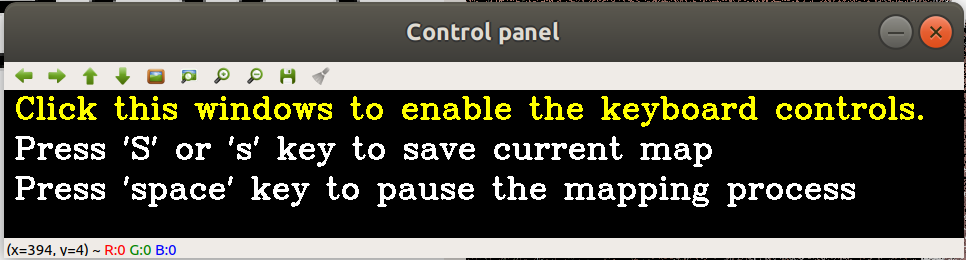

# R3LIVE
## A Robust, Real-time, RGB-colored, LiDAR-Inertial-Visual tightly-coupled state Estimation and mapping package

## News
**[Dec 29, 2021] Release of datasets**: Our datasets for evaluation can now be accessed from [Google drive](https://drive.google.com/drive/folders/15i-TRa0EA8BCbNdARVqPMDsU9JOlagVF?usp=sharing) or [Baidu-NetDisk [百度网盘]](https://pan.baidu.com/s/1zmVxkcwOSul8oTBwaHfuFg) (code提取码: wwxw). We have released totally **9** rosbag files for evaluating r3live, with the introduction of these datasets can be found on this [page](https://github.com/ziv-lin/r3live_dataset).

## 1. Introduction
**R3LIVE** is a novel LiDAR-Inertial-Visual sensor fusion framework, which takes advantage of measurement of LiDAR, inertial, and visual sensors to achieve robust and accurate state estimation. R3LIVE is built upon our previous work [R2LIVE](https://github.com/hku-mars/r2live), is contained of two subsystems: the LiDAR-inertial odometry (LIO) and the visual-inertial odometry (VIO). The LIO subsystem ([FAST-LIO](https://github.com/hku-mars/FAST_LIO)) takes advantage of the measurement from LiDAR and inertial sensors and builds the geometric structure of (i.e. the position of 3D points) global maps. The VIO subsystem utilizes the data of visual-inertial sensors and renders the map's texture (i.e. the color of 3D points). <br>
&emsp; Our preprint paper is available [here](https://github.com/hku-mars/r3live/blob/master/papers/R3LIVE:%20A%20Robust%2C%20Real-time%2C%20RGB-colored%2C%20LiDAR-Inertial-Visual%20tightly-coupled%20stateEstimation%20and%20mapping%20package.pdf), with our accompanying videos are now available on YouTube (click below images to open) and Bilibili<sup>[1](https://www.bilibili.com/video/BV1d341117d6?share_source=copy_web), [2](https://www.bilibili.com/video/BV1e3411q7Di?share_source=copy_web)</sup>.
<div align="center">
<a href="https://youtu.be/j5fT8NE5fdg" target="_blank"></a>
<a href="https://youtu.be/4rjrrLgL3nk" target="_blank"></a>
</div>

## 2. What can R3LIVE do?

### 2.1 Strong robustness in various challenging scenarios
R3LIVE is robust enough to work well in various of LiDAR-degenerated scenarios (see following figures): 
<div align="center">


</div>

And even in simultaneously LiDAR degenerated and visual texture-less environments (see Experiment-1 of our [paper](https://github.com/hku-mars/r3live/blob/master/papers/R3LIVE:%20A%20Robust%2C%20Real-time%2C%20RGB-colored%2C%20LiDAR-Inertial-Visual%20tightly-coupled%20stateEstimation%20and%20mapping%20package.pdf)).  
<div align="center">


</div>

### 2.2 Real-time RGB maps reconstruction
R3LIVE is able to reconstruct the precise, dense, 3D, RGB-colored maps of surrounding environment in real-time (watch this [video](https://youtu.be/j5fT8NE5fdg)).
<div align="center">


</div>

### 2.3 Ready for 3D applications
To make R3LIVE more extensible, we also provide a series of offline utilities for reconstructing and texturing meshes, which further reduce the gap between R3LIVE and various 3D applications (watch this [video](https://youtu.be/4rjrrLgL3nk)).
<div align="center">


</div>

## 3. Prerequisites
### 3.1 **ROS**
Following this [ROS Installation](http://wiki.ros.org/ROS/Installation) to install ROS and its additional pacakge:<br>
```
sudo apt-get install ros-XXX-cv-bridge ros-XXX-tf ros-XXX-message-filters ros-XXX-image-transport ros-XXX-image-transport*
```
**NOTICE:** remember to replace "XXX" on above command as your ROS distributions, for example, if your use ROS-kinetic, the command should be:<br>
```
sudo apt-get install ros-kinetic-cv-bridge ros-kinetic-tf ros-kinetic-message-filters ros-kinetic-image-transport*
```
### 3.2. **livox_ros_driver**
Follow this [livox_ros_driver Installation](https://github.com/Livox-SDK/livox_ros_driver).

### 3.3 **CGAL** and **pcl_viewer** (optional)
```
sudo apt-get install libcgal-dev pcl-tools
```
### 3.4 **OpenCV >= 3.3**
You can use the following command to check your OpenCV version, **if your openCV version lower than OpenCV-3.3**, we recommend you to update your you openCV version if you meet errors in complying our codes. Otherwise, skip this step ^_^
```
pkg-config --modversion opencv
```
We have successfully test our algorithm with version **3.3.1**, **3.4.16**, **4.2.1** and **4.5.3**.

## 4. Build R3LIVE on ROS:
Clone this repository and catkin_make:
```
cd ~/catkin_ws/src
git clone https://github.com/hku-mars/r3live.git
cd ../
catkin_make
source ~/catkin_ws/devel/setup.bash
```

## 5. Run our examples
### 5.1 Download our rosbag files ([r3live_dataset](https://github.com/ziv-lin/r3live_dataset)) 
Our datasets for evaluation can be download from our [Google drive](https://drive.google.com/drive/folders/15i-TRa0EA8BCbNdARVqPMDsU9JOlagVF?usp=sharing) or [Baidu-NetDisk [百度网盘]](https://pan.baidu.com/s/1zmVxkcwOSul8oTBwaHfuFg) (code提取码: wwxw). We have released totally **9** rosbag files for evaluating r3live, with the introduction of these datasets can be found on this [page](https://github.com/ziv-lin/r3live_dataset).

### 5.2 Run our examples
After you have downloaded our bag files, you can now run our example ^_^
```
roslaunch r3live r3live_bag.launch
rosbag play YOUR_DOWNLOADED.bag
```
If everything is correct, you will get the result that matches our [paper](https://github.com/hku-mars/r3live/blob/master/papers/R3LIVE:%20A%20Robust%2C%20Real-time%2C%20RGB-colored%2C%20LiDAR-Inertial-Visual%20tightly-coupled%20stateEstimation%20and%20mapping%20package.pdf) and the results posted on this [page](https://github.com/ziv-lin/r3live_dataset). 

### 5.3 Save the maps to your disk
R3LIVE allow you to save the maps you build at anytime you wanted. You just need to click on the "Control panel" and press 'S' or 's' key.
<div align="center">

</div>

### 5.3 Reconstruct and texture your mesh
After you have save your offline map on your disk (default save in directory: ${HOME}/r3live_output), you can launch our utility to reconstruct and texture your mesh.
```
roslaunch r3live r3live_reconstruct_mesh.launch
```

## 6. Sample and run your own data
Since the LiDAR data and IMU data published by the official Livox-ros-driver is with the timestamp of LiDAR (started from 0 in each recording), and the timestamp of the image is usually recorded with the timestamp of the operation system. To make them working under the same time-based, we modified the source code of Livox-ros-driver, which is available at [here](https://github.com/ziv-lin/livox_ros_driver_for_R2LIVE). We suggest you replace the official driver with it when sampling your own data for R3LIVE.


## Acknowledgments
In the development of R3LIVE, we stand on the shoulders of the following repositories:
1. [R2LIVE](https://github.com/hku-mars/r2live): A robust, real-time tightly-coupled multi-sensor fusion package.
2. [FAST-LIO](https://github.com/hku-mars/FAST_LIO): A computationally efficient and robust LiDAR-inertial odometry package.
3. [ikd-Tree](https://github.com/hku-mars/ikd-Tree): A state-of-art dynamic KD-Tree for 3D kNN search. 
4. [LOAM-Livox](https://github.com/hku-mars/loam_livox): A robust LiDAR Odometry and Mapping (LOAM) package for Livox-LiDAR.
5. [openMVS](https://github.com/cdcseacave/openMVS): A library for computer-vision scientists and especially targeted to the Multi-View Stereo reconstruction community.
6. [VCGlib](https://github.com/cnr-isti-vclab/vcglib): An open source, portable, header-only Visualization and Computer Graphics Library.
7. [CGAL](): A C++ Computational Geometry Algorithms Library.

## License
The source code is released under [GPLv2](http://www.gnu.org/licenses/) license.

We are still working on improving the performance and reliability of our codes. For any technical issues, please contact me via email Jiarong Lin < ziv.lin.ljrATgmail.com >.

If you use any code of this repo in your academic research, please cite **at least one** of our papers:
```
[1] Lin, Jiarong, and Fu Zhang. "R3LIVE: A Robust, Real-time, RGB-colored, LiDAR-Inertial-Visual tightly-coupled state Estimation and mapping package." 
[2] Xu, Wei, et al. "Fast-lio2: Fast direct lidar-inertial odometry."
[3] Lin, Jiarong, et al. "R2LIVE: A Robust, Real-time, LiDAR-Inertial-Visual tightly-coupled state Estimator and mapping." 
[4] Xu, Wei, and Fu Zhang. "Fast-lio: A fast, robust lidar-inertial odometry package by tightly-coupled iterated kalman filter."
[5] Cai, Yixi, Wei Xu, and Fu Zhang. "ikd-Tree: An Incremental KD Tree for Robotic Applications."
[6] Lin, Jiarong, and Fu Zhang. "Loam-livox: A fast, robust, high-precision LiDAR odometry and mapping package for LiDARs of small FoV."
```

For commercial use, please contact me < ziv.lin.ljrATgmail.com > and Dr. Fu Zhang < fuzhangAThku.hk >.